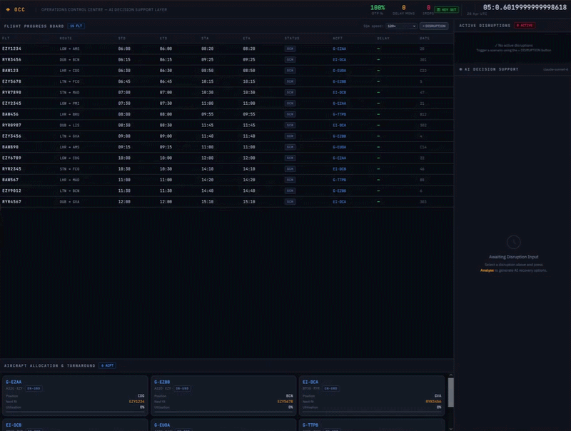

# ◈ AI-Assisted Airline Operations Control Simulation

> **An interactive OCC simulation with a live flight board, disruption injection engine, and Claude-powered decision support — running entirely in the browser.**

[](https://python.org)
[](https://anthropic.com)
[](LICENSE)
[]()

---

## What is this?

This project simulates an **Airline Operations Control Centre (OCC)**. The nerve centre where controllers manage aircraft, crew, and schedules in real time when disruptions occur.

It models a live network of 15 flights across 6 aircraft, with a time-accelerated simulation engine. When a disruption is injected (weather, mechanical fault, ATC restriction, etc.), a **Large Language Model decision support layer** analyses the situation and returns structured recovery options. Just as a real AI co-pilot tool would in an operational OCC.

**Built to explore:** how LLM-generated operational advice performs under realistic airline scheduling constraints, and how structured outputs can support time-critical decision-making.

---

## Development Note

This project was originally developed in a private repository and later published here as a public portfolio project. The commit history has been condensed as part of that transition.

---

## Demo

> Live OCC dashboard showing flight board, active disruption, and AI recovery analysis*



---

## Features

- **Live Flight Progress Board** - 15 flights advancing through `SCH → BRD → DEP → ARR` states in simulated time (1×, 30×, 120×, 300× speed)
- **Aircraft Allocation Tracker** - 6 aircraft (A320/B738/A321) with real-time position, utilisation bars, and AOG detection
- **Disruption Injection Engine** - 7 disruption types × 3 severities (21 scenarios), each with realistic delay ranges that cascade across the network
- **Claude-Powered Decision Support** - sends full flight/fleet/network context to Claude Sonnet 4 and renders structured recovery options with delay impact scores and passenger impact ratings
- **Network Performance Metrics** - live OTP %, total delay minutes, and IROPS count in the header
- **Zero dependencies** - single self-contained HTML file, no build step, no server

---

## Tech Stack

| Layer | Technology |
|---|---|
| Simulation Engine | Vanilla JavaScript (ES6+) |
| UI / Styling | Pure CSS with CSS variables |
| LLM Integration | Anthropic Claude API (`claude-sonnet-4`) |
| Font | JetBrains Mono + IBM Plex Sans |
| Deployment | Single HTML file - open in any browser |

---

## Getting Started

### 1. Clone the repo

```bash
git clone https://github.com/vatty-v2/AI-Assisted-Airline-Operations-Control-Simulation-PUBLIC.git
cd AI-Assisted-Airline-Operations-Control-Simulation-PUBLIC
```

### 2. Open the simulation

No build step required. Simply open the file in your browser:

```bash
open occ_simulation.html        # macOS
start occ_simulation.html       # Windows
xdg-open occ_simulation.html    # Linux
```

### 3. Add your Anthropic API key

On first load, a key prompt appears in the bottom-right corner. Enter your `sk-ant-api03-...` key.It is stored in `localStorage` and sent **only** to `api.anthropic.com`.

Get a key at [console.anthropic.com](https://console.anthropic.com) → API Keys.

> The key badge in the top-right header shows `⚿ KEY SET` (green) once saved. Click it anytime to update.

---

## Usage

### Running a disruption scenario

1. Click **`+ DISRUPTION`** in the top-right of the flight board
2. Select a disruption type, severity, and affected airport
3. Optionally add context notes (e.g. *"Runway 08L closed due to FOD"*)
4. Click **Inject Disruption** - delays cascade across all flights at that airport

### Triggering AI analysis

1. In the **Active Disruptions** panel, click **`◈ Analyse with AI`**
2. The full operational context is sent to Claude Sonnet 4:
   - Disruption metadata (type, severity, description)
   - Affected flight details (route, STD, current delay, status)
   - Fleet status (registration, type, position, AOG flag)
   - Network-level KPIs (total delay minutes, cancellations, diversions)
3. The AI returns a structured response rendered as:
   - **Immediate Actions** (0–15 min)
   - **Three Recovery Options** with delay impact and passenger impact scores
   - **Recommended option** with justification
   - **KPIs to monitor**

### Simulation speed

Use the **Sim speed** dropdown (top-right) to advance time:
- `1×` - real-time observation
- `120×` - default, one hour of ops per 30 seconds
- `300×` - full day scenario in ~3 minutes

---

## How the AI Layer Works

The prompt is **dynamically constructed at runtime** from live simulation state:

```
DISRUPTION REPORT       ← type, severity, airport, description
AFFECTED FLIGHTS        ← flight IDs, routes, current delay, status
NETWORK STATUS          ← OTP, total delay mins, cancellations, diversions
AIRCRAFT FLEET          ← each tail's type, operator, position, AOG flag
```

The model is instructed to respond **only in JSON**, which is parsed and rendered into the structured decision support UI. This mirrors how a real OCC decision-support tool would work: the AI's role is to surface options quickly, not to act autonomously.

---

## Disruption Scenarios

| Type | Low | Medium | High |
|---|---|---|---|
| 🌩 Weather | Strong crosswind (+10–25 min) | Low visibility procedure (+20–50 min) | Severe thunderstorm / ground stop (+60–120 min) |
| 🔧 Mechanical | Minor MEL item (+15–30 min) | Tech delay (+45–90 min) | AOG critical fault (+120–240 min) |
| 👤 Crew | Hotel transport delay (+15–30 min) | Crew positioning (+30–70 min) | FTL exceedance risk (+90–180 min) |
| 📡 ATC | Airborne hold (+10–20 min) | ATFM slot restriction (+25–60 min) | Sector closure / action (+60–150 min) |
| 🛬 Ground Ops | Late pax boarding (+10–20 min) | Baggage system outage (+25–45 min) | Gate/terminal block (+40–80 min) |
| 🔒 Security | Lane closure (+10–20 min) | Enhanced screening (+20–45 min) | Terminal evacuation (+60–120 min) |
| 🩺 Medical | Gate incident (+10–25 min) | Medical diversion (+60–120 min) | In-flight emergency / PAN (+45–90 min) |

---

## Key Design Decisions

**Structured JSON outputs** - the AI is constrained to return valid JSON rather than freeform text. This ensures the response is always renderable as a decision support card, not just a paragraph of advice.

**Full context injection** - rather than a static system prompt, the entire operational picture is reconstructed per-request. This means the AI's recommendations are always grounded in the current sim state.

**No hallucination guardrails (intentional)** - this is a simulation; the AI's suggestions are evaluated for operational plausibility rather than filtered, which is useful for studying where LLM reasoning succeeds or fails in scheduling domains.

---

## Roadmap

- [ ] Aircraft swap / substitution recommendations applied back to the sim state
- [ ] Crew FTL tracking per aircraft leg
- [ ] Multi-day scenario with overnight positioning
- [ ] Passenger rebooking cost model per recovery option
- [ ] Side-by-side comparison of AI options vs. human controller decisions
- [ ] Export disruption log and AI responses to PDF debrief report

---

## License

MIT - see [LICENSE](LICENSE) for details

---

*Not affiliated with any airline or OCC operator.*
